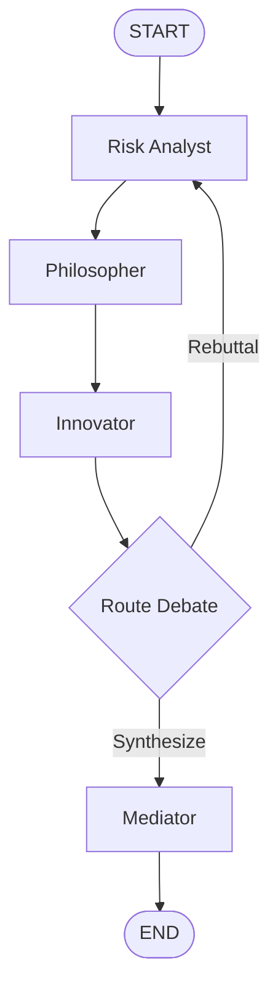

# The AI Council


An autonomous AI council that debates strategic decisions from multiple perspectives, calculates financial runway from structured inputs, performs supporting web research, challenges its own assumptions, and produces a structured final recommendation with trade-offs, dissenting views, sources, and a concrete 30-day action plan.

---

## Overview

**The Council** is a stateful multi-agent decision-making system built with **LangGraph**, **Google Gemini**, **Pydantic**, and **DuckDuckGo search**.

The system models an executive council composed of specialized AI agents:

- **Risk Analyst** — prioritizes solvency, downside protection, cash conservation, and mitigating existential bankruptcy risk.
- **Philosopher** — evaluates human capital, organizational integrity, stakeholder trust, and moral purpose.
- **Innovator** — focuses on asymmetric upside, product-market expansion, revenue scalability, and enterprise value creation.
- **Mediator** — synthesizes all opposing council perspectives into a coherent, actionable, and de-risked strategic plan.

The dilemma example for demonstration throughout this documentation is the following:

> Should our startup pivot to an enterprise-only SaaS model?

---

## How It Works

1. A `UserContext` is created with the dilemma, background constraints, and proposed options.
2. The **Risk Analyst** evaluates the decision through a financial and solvency lens.
3. The **Philosopher** evaluates the impact on employees, users, stakeholders, and organizational purpose.
4. The **Innovator** evaluates market upside, scalability, and enterprise value creation.
5. Structured financial inputs are converted into net monthly burn and calculated runway metrics for the agents.
6. The council may enter additional rebuttal rounds when agents disagree.
7. The **Mediator** synthesizes the complete debate into a `DecisionMatrix`.
8. The application prints the recommendation, consensus score, trade-offs, dissenting views, 30-day action plan, and compiled research sources.

---

## Architecture



### Project Architecture

```text
.
├── agents.py       # Risk Analyst, Philosopher, Innovator, and Mediator nodes
├── graph.py        # LangGraph state graph and workflow edges
├── main.py         # Demonstration entrypoint and terminal reporting
├── router.py       # Debate continuation and synthesis routing logic
├── schemas.py      # Pydantic models and shared CouncilState definition
├── tools.py        # Financial runway calculator and DuckDuckGo search tool
├── LICENSE         # MIT License
└── .gitignore      # Environment variables and generated-file exclusions
```

---

## Agent Responsibilities

### 1. Risk Analyst Agent

The Risk Analyst is the **Chief Risk Officer on the executive council**.

Its primary fiduciary duty is solvency, downside protection, cash conservation, and mitigating existential bankruptcy risk. It prioritizes worst-case scenarios, audit lead-times, regulatory burdens, and counterparty delivery failures over speculative growth claims.

The agent uses a scoped research query for:

```text
enterprise SaaS SOC 2 compliance cost timeline cash burn
```

During rebuttal rounds, it interrogates financial assumptions, challenges dangerous growth optimism, and evaluates cash-flow assumptions, procurement realities, delayed legal redlining, and audit bottlenecks.

### 2. Philosopher Agent

The Philosopher is the **Ethical Officer on the executive council**.

Its fiduciary duty is to human capital, organizational integrity, stakeholder trust, and moral purpose. It evaluates actions through the lens of honesty, duty of care toward employees, transparency with users, and long-term brand equity.

The agent uses a scoped research query for:

```text
startup pivot employee burnout and customer trust impact
```

During rebuttal rounds, it challenges proposals that compromise human flourishing, employee trust, or ethical transparency.

### 3. Innovator Agent

The Innovator is the **Chief Innovation and Growth Officer on the executive council**.

Its fiduciary duty is asymmetric upside, product-market expansion, revenue scalability, and enterprise value creation. It views prolonged stagnation as the fastest route to bankruptcy and champions decisive, offensive strategic moves over defensive cost-cutting.

The agent uses a scoped research query for:

```text
B2B enterprise SaaS ARR revenue valuation multiples
```

During rebuttal rounds, it challenges defensive conservatism, risk-averse paralysis, and reluctance to capture high-value enterprise demand.

### 4. Mediator Agent

The Mediator is the **impartial Executive Chairman and Council Mediator**.

Its fiduciary duty is to synthesize all opposing council perspectives into a coherent, actionable, and de-risked strategic plan.

The Mediator balances:

- The solvency rigor of the Risk Analyst
- The mission integrity of the Philosopher
- The growth ambitions of the Innovator

It produces the final recommendation and a pragmatic, week-by-week `action_plan_30_days`.

---

## Debate Routing Logic

The debate is controlled by `route_debate` in `router.py`.

The system moves to synthesis when one of the following conditions is reached:

1. The maximum round cap is reached. The current cap is **3 rounds**.
2. All agents reach full consensus on the same proposed option.
3. Agents retain the same choices after a rebuttal round.

If none of these stopping conditions is met, the graph loops back to the **Risk Analyst** for another rebuttal round.

---

## Security and Alignment Protections

The agents share a defensive prompt-engineering protocol that includes:

- **Untrusted data enclaves** for user input, retrieved web facts, and debate history.
- **Strict persona and topic lockdown** to keep each agent focused on its designated role and decision dilemma.
- **Anti-hallucination source verification**, requiring cited URLs to appear verbatim in retrieved web data.
- **Mathematical and factual consistency**, requiring financial metrics to remain consistent with the provided cash runway, burn rate, and contract terms.

The agents also use structured output schemas so model responses are validated against the expected Pydantic models.

---

## Built-in Tools

### Financial Runway Calculator

`calculate_financial_runway` calculates how many months of cash remain based on savings, monthly expenses, and current income.

The updated agent workflow uses `format_financials` to calculate and inject these values into the initial Risk Analyst, Philosopher, and Innovator prompts. The formatted context includes liquid savings, monthly expenses, monthly income, net monthly burn, and calculated runway.

```python
from tools import calculate_financial_runway

result = calculate_financial_runway(
    liquid_savings=150000,
    monthly_expenses=25000,
    current_income=5000,
)

print(result.runway_months)
print(result.net_monthly_burn)
print(result.is_infinite)
```

The calculation is based on:

```text
net burn = monthly expenses - current income
runway = liquid savings / net burn
```

If income covers or exceeds expenses, the tool returns an infinite runway and sets `is_infinite` to `True`.

### Financial Context Formatting

The `format_financials` helper in `agents.py` converts the optional financial fields from `UserContext` into a readable prompt context. When the values are present, it includes:

- Liquid savings
- Monthly expenses
- Monthly income
- Net monthly burn
- Calculated runway

The formatted financial context is provided to the initial Risk Analyst, Philosopher, and Innovator prompts. If the structured financial values are not provided, the helper returns `No structured financial numbers provided.`

### Web Research Tool

`search_web_resources` uses DuckDuckGo to retrieve supporting articles, studies, facts, and statistics for the council agents.

Each result is normalized into a `SearchResultItem` containing:

- `title`
- `snippet`
- `url`

Agents are instructed to cite only URLs returned by the retrieved web data.

---

## Structured Data Models

The project defines the following models in `schemas.py`:

### `UserContext`

Stores the primary decision dilemma, background context, proposed choices, and optional financial information.

### `AgentPosition`

Stores an agent's initial position, including:

- Preferred option index
- Confidence score
- Core argument
- Key metrics
- Sources

### `Rebuttal`

Stores an agent's response during a rebuttal round, including:

- Target agent
- Points challenged
- Concession
- Revised option index
- Revised confidence score
- Sources

### `DecisionMatrix`

Stores the final synthesized decision, including:

- Recommended option
- Consensus score
- Key trade-offs
- Dissenting views
- 30-day action plan
- Sources

### `CouncilState`

The shared LangGraph state contains:

- `user_context`
- `positions`
- `rebuttals`
- `revision_count`
- `final_matrix`

---

## Prerequisites

Install the following before running the project:

- Python 3.10+
- A Google API key with access to the configured Gemini model
- Internet access for DuckDuckGo web research

---

## Installation

### 1. Clone the repository

```bash
git clone https://github.com/shathahsaleem/the-ai-council
cd "the-ai-council"
```

### 2. Create and activate a virtual environment

#### macOS / Linux

```bash
python3 -m venv .venv
source .venv/bin/activate
```

#### Windows PowerShell

```powershell
python -m venv .venv
.venv\Scripts\Activate.ps1
```

### 3. Install dependencies

The project does not currently include a `requirements.txt` file. Install the imported packages with:

```bash
pip install langgraph langchain-google-genai pydantic python-dotenv ddgs
```

### 4. Configure the API key

Create a local `.env` file in the project root:

```env
GOOGLE_API_KEY=your_google_api_key_here
```

The application loads this value through `python-dotenv`.

---

## How to Run

Run the demonstration entrypoint from the project root:

```bash
python main.py
```

The program will:

1. Print a banner for the autonomous AI council debate.
2. Run the Risk Analyst, Philosopher, and Innovator nodes.
3. Perform additional rebuttal rounds when required by the router.
4. Run the Mediator synthesis.
5. Print the final recommended option, consensus score, key trade-offs, dissenting views, action plan, and research sources.

The updated demonstration starts with this sample context:

```text
DILEMMA:
Should our startup pivot to an enterprise-only SaaS model?

BACKGROUND & CONSTRAINTS:
We have 6 months of runway left ($150,000 liquid cash). Current B2C revenue is flat at $5,000/month. Our monthly burn rate is approximately $25,000. Two enterprise clients have expressed strong intent and offered $50,000 annual contracts each, but only if we build custom security compliance features.

PROPOSED OPTIONS:
1. Pivot fully to enterprise SaaS
2. Maintain current B2C model and cut operational costs
3. Hybrid model: Keep B2C live while building enterprise features

STRUCTURED FINANCIAL INPUTS:
Liquid savings: $150,000.00
Monthly expenses: $25,000.00
Current income: $5,000.00
Net monthly burn: $20,000.00
Calculated runway: 7.5 months
```

---

## Reliability and Rate-Limit Handling

The project includes safeguards for transient model-service issues:

- `safe_invoke` retries calls after Google `503` / `UNAVAILABLE` errors.
- The retry wrapper uses a maximum of three attempts.
- Retry waits increase by 15 seconds per attempt.
- `throttle_api` pauses for 12 seconds between model calls to help stay within Google's free-tier requests-per-minute limits.

---

## Example Final Output Structure

When a final decision matrix is generated, the terminal reports:

```text
FINAL MEDIATOR SYNTHESIS & DECISION

RECOMMENDED OPTION:
   <recommended option>

COUNCIL CONSENSUS SCORE: <score>%

KEY TRADE-OFFS ACKNOWLEDGED:
   • <trade-off>

REMAINING DISSENTING VIEWS / RISKS:
   • <dissenting view>

30-DAY CONCRETE ACTION PLAN:
   [ ] <action item>

COMPILED RESEARCH SOURCES:
    <source URL>
```

---

## Customizing the Decision

To evaluate a different dilemma, update the `UserContext` in `main.py`:

```python
user_context = UserContext(
    dilemma_statement="Your decision question",
    background_context="Relevant history, values, and constraints",
    proposed_options=[
        "First option",
        "Second option",
        "Third option",
    ],
)
```

Optional financial fields are available through the schema:

```python
user_context = UserContext(
    dilemma_statement="Your decision question",
    background_context="Relevant context",
    proposed_options=["Option A", "Option B"],
    liquid_savings=150000,
    monthly_expenses=25000,
    current_income=5000,
)
```

---

## License

This project is open-source software licensed under the **MIT License**.

Copyright (c) 2026 Shathah Saleem.

---

